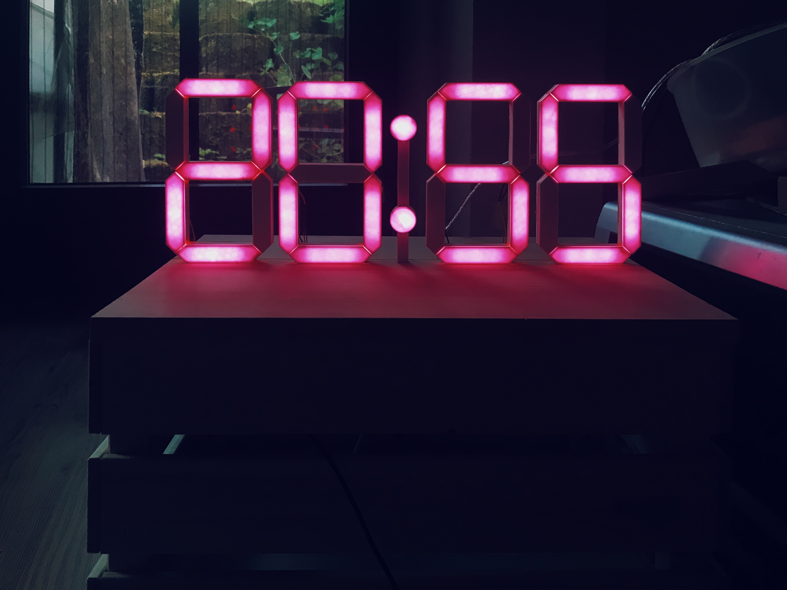

# diy_clock
### Magic clock

  

  

### Hardware:
  1. board: NodeMCU 1.0
  2. 3d printed number
### Functions:
  1. Using MQTT 
    * "/clock/onoff": onoff:1 #on
    * "/clock/color": color:50,255,255 #HSV
    * "/clock/adjust": adjust:-1 #switch between summer time and winter wime
    
